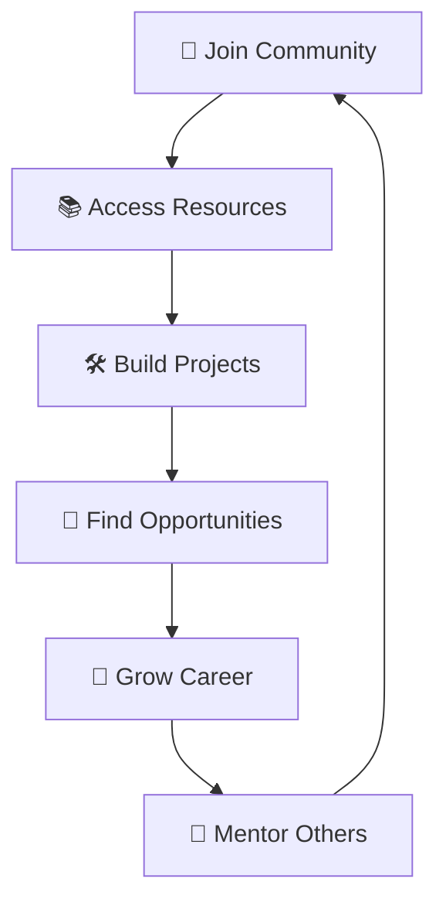

<div align="center">

# 🚀 **Syntax Syndicate**

### *Learn • Build • Grow*

[](https://syntax-syndicate.onrender.com/)
[](https://syntax-syndicate.onrender.com/)
[](https://syntax-syndicate.onrender.com/)

---

*A community‑led developer collective focused on practical, project‑based learning through workshops, curated resources, and small‑cohort mentorship.*

</div>

## 🎯 **One-Line Mission**

> **Syntax Syndicate** empowers students and early‑career developers to build real projects, portfolios, and career pathways through collaborative learning experiences.

---

## 🌟 **About Our Organization**

<table>
<tr>
<td width="60%">

**Syntax Syndicate** operates as a student‑focused tech community that bridges the gap between theoretical learning and practical application. We curate study resources, run hands‑on workshops, share exclusive internship opportunities, and maintain focused peer support groups.

Our platform unites learners from multiple institutes, offering:
- 📚 **Targeted study materials**
- 🛠️ **Hands-on workshops** 
- 🤝 **Collaborative growth sessions**
- 🎯 **Cohort-style mentorship**

</td>
<td width="40%">

```ascii
    ╭─────────────────────╮
    │ •Learn •Build •Grow │
    ├─────────────────────┤
       🎓 Students         
       💼 Professionals   
       🌱 Mentors         
    ╰─────────────────────╯
```

</td>
</tr>
</table>

---

## 🎨 **Website Features**

<details>
<summary><b>🏠 Hero & Landing Experience</b></summary>

- **Clear Value Proposition** — "Learn • Build • Grow" messaging
- **Primary CTA** — Streamlined community join flow
- **Visual Impact** — Professional, conversion-optimized design

</details>

<details>
<summary><b>👥 Community Integration</b></summary>

- **WhatsApp Groups** — Direct access to specialized communities
- **Group Segmentation** — Targeted cohorts for different skill levels
- **Social Proof** — Live member counts and activity metrics

</details>

<details>
<summary><b>📚 Resource Hub</b></summary>

- **Internship Alerts** — Curated opportunity notifications
- **Institution Resources** — Terna College & IIT-Madras materials  
- **Community Courses** — Peer-generated learning content
- **Career Roadmaps** — Structured development pathways

</details>

<details>
<summary><b>🔗 Connectivity</b></summary>

- **Quick Links** — GitHub, LinkedIn, and community touchpoints
- **Professional Footer** — Clean attribution and copyright information

</details>

---

## 🎯 **Specialized Groups**

<div align="center">

| Group | Focus | Status |
|-------|-------|--------|
| 🔥 **Open Internships & Certifications** | Career opportunities | `Active` |
| 💻 **Open Web Development** | Full-stack development | `Active` |
| 🎓 **TEC F.E** | First-year engineering | `Active` |
| 📈 **TEC S.E** | Second-year engineering | `Active` |

</div>

---

## 🌈 **What This Means for You**

<div align="center">



</div>

### **For New Learners**
- 🚀 **Quick Entry** — Join group channels instantly
- 📖 **Curated Materials** — Access quality study resources
- 🎯 **Clear Pathways** — Structured learning progressions

### **For Students**
- 🏫 **Institution-Specific** — Targeted resources for partner institutions
- 👥 **Peer Cohorts** — Connect with classmates and seniors
- 🎪 **Event Access** — Workshop announcements and showcases

### **For Career Growth**
- 💼 **Internship Alerts** — Exclusive opportunity notifications
- 📈 **Portfolio Building** — Project-based learning approach
- 🌐 **Network Expansion** — Connect with industry professionals

---

## 👥 **Leadership & Contributors**

<div align="center">

### **Core Team**

<table>
<tr>
<td align="center" width="33%">

<br><b>Piyush Koli</b><br>
<sub><i>Founder</i></sub><br>
<small>Content direction • Community coordination</small>
</td>
<td align="center" width="33%">

<br><b>Adinath Jagtap</b><br>
<sub><i>Co-founder</i></sub><br>
<small>Site architecture • Deployment</small>
</td>
<td align="center" width="33%">

<br><b>Community Leaders</b><br>
<sub><i>Volunteers & Mentors</i></sub><br>
<small>Workshops • Content • Testing • Promotion</small>
</td>
</tr>
</table>

</div>

---

## 🎨 **Brand Guidelines**

### **Voice & Tone**
- ✅ **Professional** — Maintain credibility and trust
- ✅ **Supportive** — Foster inclusive learning environment  
- ✅ **Outcome-Driven** — Focus on tangible results
- ✅ **Concise** — Respect users' time and attention

### **Visual Standards**
- 🖼️ **Authentic Content** — Real student project screenshots
- 🎨 **Stylized Illustrations** — Custom graphics over stock photos
- ♿ **Accessibility First** — Semantic HTML, proper contrast
- 📱 **Mobile Optimized** — Responsive design principles

---

## 📊 **Content Strategy**

### **Page Structure**
```
├── 🏠 Home (Hero + CTAs)
├── 🛠️ Workshops (Event-driven)
├── 🤝 How to Join (Simple onboarding)
├── 🎨 Student Projects (Portfolio showcase)
└── 📚 Resources (Curated materials)
```

### **Content Calendar**
- 📅 **Monthly Highlights** — Student achievements and project showcases
- 🎉 **Event Recaps** — Workshop summaries with social proof
- 🚀 **Quick Updates** — Community growth and opportunities

---

## 🔒 **Privacy & Contact**

### **Data Protection**
- 📝 **Minimal Collection** — Name and email only
- 🎯 **Clear Purpose** — Workshop administration and updates
- ✉️ **Unsubscribe Options** — Easy opt-out mechanisms

### **Get in Touch**
- 🏢 **Official Inquiries** — Partnership and sponsorship opportunities
- 📧 **Contact** — Visit our website's contact section
- 💼 **Business** — Professional team email available

---

<div align="center">

## 🚀 **Ready to Join?**

[](https://syntax-syndicate.onrender.com/)
[](https://syntax-syndicate.onrender.com/)
[](https://syntax-syndicate.onrender.com/)

---

### **Stats That Matter**


---

**© 2025 Syntax Syndicate • All rights reserved**

*Building the future, one developer at a time* 🚀

</div>

---

<div align="center">
<sub>Made with ❤️ by the Syntax Syndicate community</sub>
</div>
